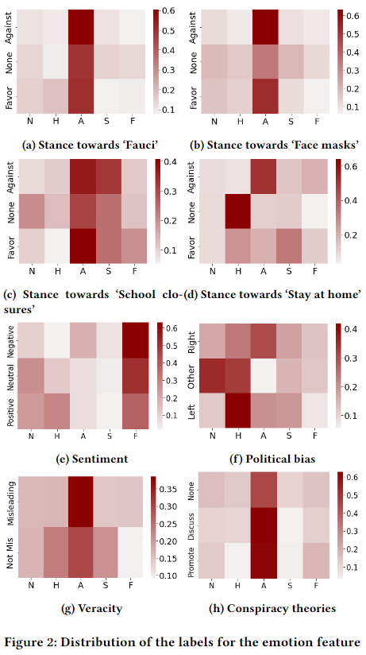

# Analyzing COVID-Related Social Discourse on Twitter using Emotion, Sentiment, Political Bias, Stance, Veracity and Conspiracy Theories

## Abstract
Online misinformation has become a major concern in recent years, and it has been further emphasized during the COVID-19 pandemic. Social media platforms, such as Twitter, can be serious vectors of misinformation online. In order to better understand the spread of these fake-news, lies, deceptions, and rumours, we analyze the correlations between the following textual features in tweets: emotion, sentiment, political bias, stance, veracity and conspiracy theories. We train several transformer-based classifiers from multiple datasets to detect these textual features and identify potential correlations using conditional distributions of the labels. Our results show that the online discourse regarding some topics, such as COVID-19 regulations or conspiracy theories are highly controversial and reflect the actual U.S. political landscape.

## Code
This repository contains notebooks to train the three different models (sentiment, emotion, political bias) and to perform some data analysis. 

## Citations
Please cite this work as below:

```
@inproceedings{Peskine_BeyondFacts_2023,
author = {Peskine, Youri and Troncy, Raphael and Papotti, Paolo},
title = {{Analyzing COVID-Related Social Discourse on Twitter using Emotion, Sentiment, Political Bias, Stance, Veracity and Conspiracy Theories}},
proceedings = {3rd International Workshop on Knowledge Graphs for Online Discourse Analysis (BeyondFacts)},
doi = {10.1145/3543873.3587622},
year = {2023}
}
```


## Results
The heatmaps obtained with the different models can be seen on the following figures.

*Sentiment*:


*Emotion*:



*Political bias*:


